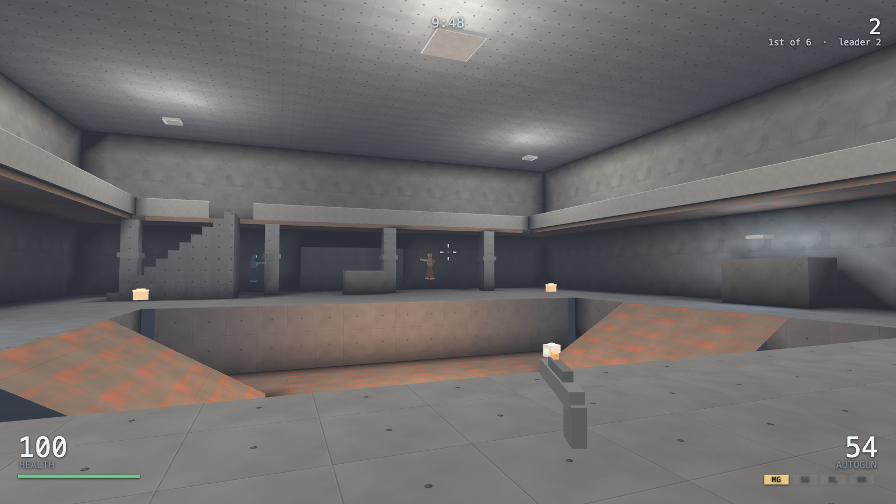
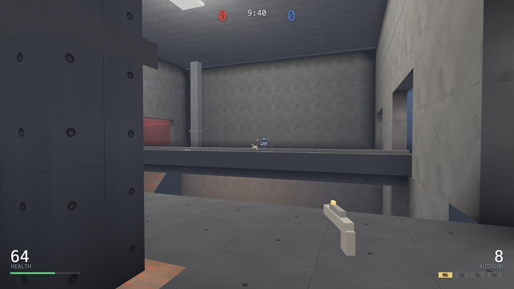
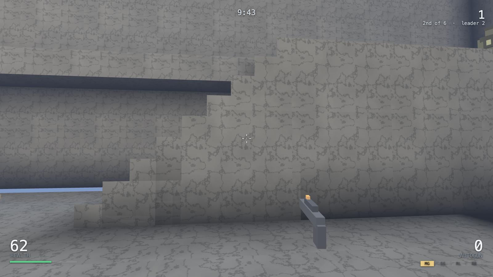
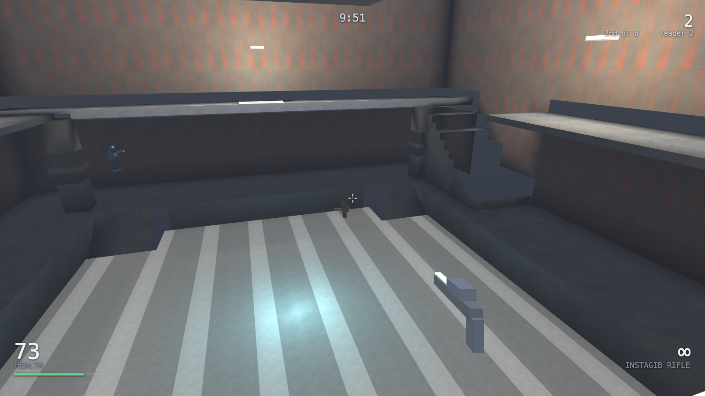
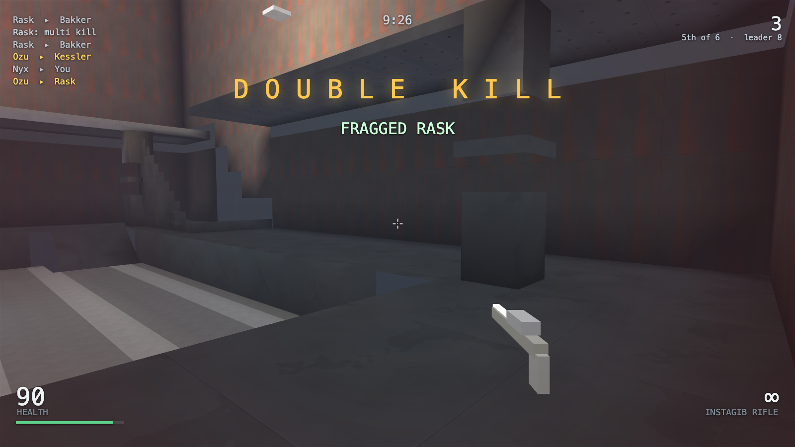
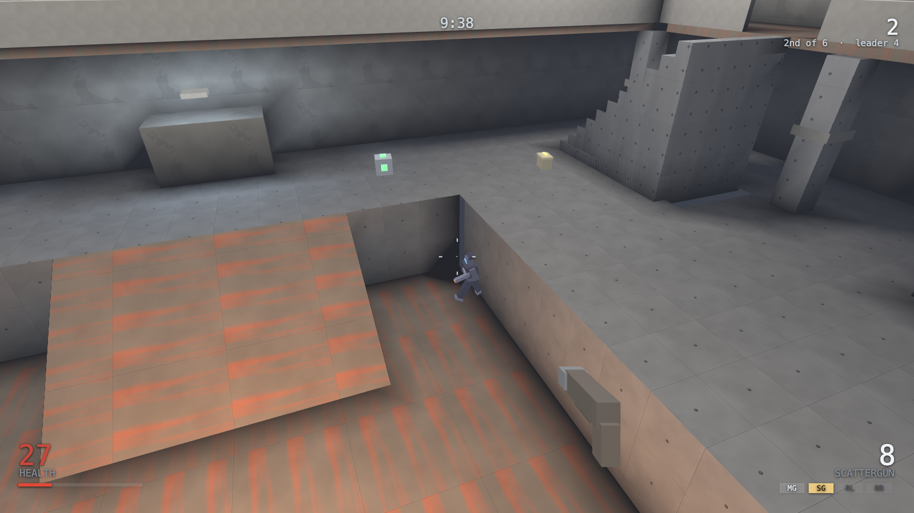
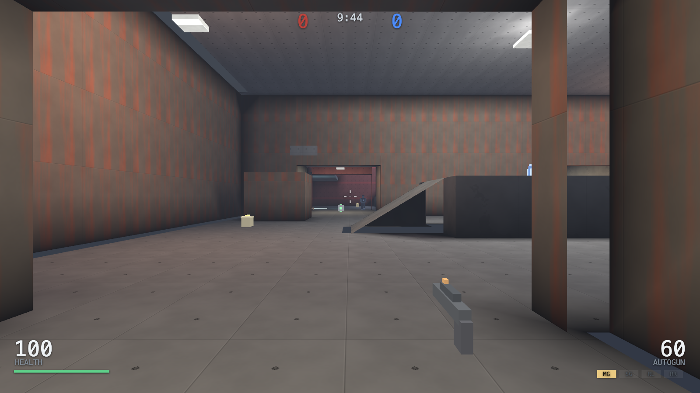

# WebReal

### ▶ [Play it](https://markclausing.github.io/webreal/)

An arena shooter in the browser. Five arenas, four guns and a rifle that kills
with one shot, up to four people over the wire and bots to make up the numbers.

No dependencies, no build step, no assets: HTML, CSS and JavaScript exactly as
the browser receives them. The one thing this game has that the others in the
series have not is WebGL — an arena shooter is a first person view of a lit room
at a hundred and twenty frames a second, and a rasteriser written by hand into a
`Uint32Array` will not do that on a phone.



*Foundry. The rocket launcher is at the bottom of the hole; everything else is on
the walkway over your head.*

## The light is baked, and it is baked out of the same boxes you walk into

Every arena is a few hundred axis-aligned boxes, because that is what the
simulation collides against and a box against a box needs no tolerances. Before
a match starts, those boxes are cut into fifteen thousand small quads and the
light is worked out at every corner of every one of them:

**Every lamp within reach**, attenuated, angled to the surface, and blocked if
there is a wall in the way — a real shadow ray against the same geometry the
shooting uses.

**Occlusion**, as a short fan of rays off each surface: how much of the room can
this corner see? It is what darkens the inside of corners and the underside of
the walkways, and it is most of the reason the picture reads as a place rather
than as a diagram.

**And whatever lights itself** — lamps, rails, the plates on the jump pads.

It costs about a tenth of a second per arena and it happens once. The only
lighting the graphics card computes while you play is the four or five things
actually on fire at that moment: a muzzle flash, a rocket in the air, the blast
when it lands.

Nothing is loaded from anywhere, either. The eight surfaces — concrete,
panelling, rust, floor plate, lamp trim, two team colours and rock — are drawn
into a canvas at startup out of a seeded generator, in about eight milliseconds,
and that is why this repository has no `assets/` folder.



*Bastion, from the middle of the bridge. Six metres down is the rocket, and one
way out at each end.*

## Five arenas

**Foundry** — a hall with a hole in the middle of it. Two ramps down, one pad
back up, and a gantry round the outside with the rifle, the armour and a view of
everybody in the pit.

**Cistern** — three storeys and thirty metres across. Water at the bottom, a
ledge round the walls, and an island at the top that can only be reached by a
pad you can be shot off.

**Overlook** — open ground under a sky, and a mesa in the middle with the rail
rifle on top of it. Standing there is the plan and the mistake.

**Bastion** *(flags)* — two bases, one narrow bridge, and a chasm under it with
the rocket at the bottom.

**Sluice** *(flags)* — a quicker flag map. Two runs out of every base and a
walkway that puts you over the head of whoever is guarding the floor.

The two flag maps are written as one half and reflected, so they are fair by
construction rather than because somebody measured them. `npm run test:map`
checks that, along with everything else about an arena that looks fine and plays
like a locked door — see below.



## Three ways to play, and one that changes all three

**Deathmatch** is twenty frags and everybody for themselves. **Team deathmatch**
is the same with sides and no friendly fire. **Capture the flag** is three
captures, and yours has to be on its stand for one of them to count — the rule
that makes a defender worth having.

**Instagib** switches any of them to one rifle, one shot and one hit. Nothing to
pick up and nowhere to hide: everything is decided by who saw whom, and a match
that took three minutes takes ninety seconds.



## The announcer

He is not a recording, and he is not the browser's speech synthesis either. He is
formant synthesis — a buzzing source through four sharp resonances, which is
roughly what the speech chips of the era did — shared verbatim with the other
games in this series, and taught about sixty words of his own here.

What he says is what a tournament announcer says. Two kills inside four seconds
is a **double kill**, and it goes up through multi, mega, **ultra** and monster
to a name that is plainly a joke, because by then so is the situation. Kills
without dying are a **killing spree**, a rampage, dominating, unstoppable,
**godlike** and finally wicked sick. There is **first blood** once a match,
**payback** for killing whoever killed you last, and the flag — taken, dropped,
returned, and which team just scored.

He announces your kills and everybody's flags, which is the division that works:
a voice that called every double kill in a six-body match would be talking over
itself, and a voice that ignored the flag would be no use to the two people
chasing it. Everybody else's sprees go down the side of the screen instead.
`npm run test:sound` checks he can actually pronounce every line he is given —
a word he has not been taught is not mispronounced, it is silently left out,
which is the sort of bug you only find by looking for it.



## Four guns and what each is for

|                | Damage                | Rate     | What it answers |
| -------------- | --------------------- | -------- | --------------- |
| **Autogun**    | 9                     | 10/s     | Everything, badly. Its spread opens while you hold it and closes when you let go, so it is short bursts or nothing. |
| **Scattergun** | 8 × 10 pellets        | 1.25/s   | Somebody in a doorway. |
| **Rockets**    | 92 direct, 78 splash  | 1.1/s    | Somebody in the air, somebody round a corner, and getting yourself onto the gantry. |
| **Rail rifle** | 68                    | 0.6/s    | Somebody across the map who has not seen you. |

The blast from a rocket does not go round corners — there is a visibility check
on the splash — and it does about half as much to you as to them, which is what
makes a rocket jump cost thirty health rather than your life.

## How it moves

**Friction is savage and acceleration is enormous.** On the floor you are at top
speed within two frames and stopped within three. All of the give in the controls
is in the air, and there is very little of it: what a jump can be steered by is
capped at a metre and a half a second.

**Which means the air is where the skill is.** Point the buttons across your own
direction of travel while you are off the ground and you gain a little speed
every jump. Nobody has to know that, and a player who does know it crosses
Foundry a second and a half quicker than a player who does not.

**A step of half a metre is walked up without noticing.** Everything in every
arena is built under that: stairs, kerbs, the lip of a platform. The camera
chases your feet rather than following them, so a staircase is a climb instead of
a series of jolts.



## The bots

They run inside the simulation rather than beside it: a bot returns the same
three fields your mouse and keyboard do, and the simulation cannot tell which is
which. That is not tidiness — in a lockstep game every machine runs every bot,
so a bot that consulted the clock, or `Math.random`, or how fast one particular
laptop is, would turn left here and right there and the match would come apart.

They read the arena rather than a set of waypoints laid over it. A column is
dropped every metre and a half, every surface a body actually fits on is found,
and the ones you can get between are joined — walking, climbing, dropping,
jumping onto a crate, or riding a pad, with the pad's landing point worked out by
throwing something off it and watching where it lands. Add a box to a map and the
bots know about it.

The difference between Rookie and Brutal is four numbers: how big the aim error
is, how long it takes them to notice you, how well they lead a moving target, and
how single-minded they are about picking things up. There is no bot that sees
through walls and no bot that is given free damage.

## Controls

|            | Keys                    |
| ---------- | ----------------------- |
| Move       | `W` `A` `S` `D`         |
| Look       | Mouse                   |
| Fire       | Left click              |
| Jump       | `Space`                 |
| Weapons    | `1`–`4`, or the wheel   |
| Scores     | `Tab`                   |
| Pause      | `Esc`                   |

Every key can be changed in the menu, and there are presets for W A S D, E S D F
and the arrows. Gamepads need no setting up: left stick walks, right stick looks,
right trigger fires.

On a phone the controls come up on their own. The left half of the picture is a
stick that appears wherever you first touch it; the right half is the aim, and a
tap in it fires — because on a phone the thing you most want after pointing at
somebody is to shoot them, and reaching for a button loses the aim. `FIRE`,
`JUMP` and `WPN` are along the bottom right where a thumb already is.

The thumb and the mouse are two different instruments and they do not share a
setting. Both have their own speed in the menu — a stepper, not four presets,
because the number that suits a thumb is about twice the one that suits a mouse —
and the thumb has its own invert for each axis. Its vertical starts inverted,
because that is what a thumb wants: drag down and the view tips up, as though you
were holding the screen rather than pushing a pointer.

`Thumbs: Always` puts the thumb controls on a machine that never asked for them,
which is how you try them without a phone. The mouse goes on working alongside
them — the thumb layer takes touches and pens and leaves mouse pointers to the
mouse, so a laptop with a touchscreen has both.

The playing surface is marked `touch-action: none`, which is not a detail. Left
off, the first few pixels of every drag arrive and then the browser decides the
gesture is a scroll, keeps the rest of it and cancels the pointer — which feels
exactly like a look control set far too slow, because every swipe is worth one
step of it and then stops.

`npm run test:keys` drives a real browser and checks which way the view went and
how far, for the mouse and for the thumb, both ways round. It is there because
three separate things in this game were the wrong way round and none of them was
visible from reading the code: the mouse turned left when it went right, the
strafe buttons were swapped, and the damage marker pointed a quarter turn off.
All three were the same mistake — an angle convention assumed rather than
derived — and the fix was to derive it once, in `walkBasis`, and have the
simulation, the bots and the tests all read that.

## Four people, one match, no server that decides anything

One of you opens a room and reads out the four-letter code; the rest join it.
Everything is simulated on every machine and only buttons cross the wire, so
there is nothing in the middle deciding who got shot.

The aim is the one thing that had to be added to the netcode the other games in
this series share. It travels with the buttons, as an integer, and is applied on
the same tick everywhere — but the camera on your own machine reads the mouse
directly, so the view turns the instant you move it even though the tick it
belongs to is still four frames away from being agreed. A laggy camera is
unplayable; a shot that lands four ticks late is a shot that lands.

Input is sent ahead of time and the delay tunes itself to the connection. If
somebody's input is not there anyway the simulation waits rather than guessing,
so nobody can drift apart from anybody else, and a state hash is compared once a
second to prove it.

The copy linked at the top already has a relay: a Cloudflare Worker, which is
about two hundred lines in [worker/](worker/) and a single Durable Object,
because a Worker on its own is stateless and cannot hold four sockets in the same
room. It stores nothing at all — a room exists while its sockets are open and is
forgotten when the last one closes — and it never sees a position, a score or a
hit. `npm start` does the same job locally in the same number of lines, and
`npm run test:net` is pointed at that one.



## Running it yourself

```bash
git clone https://github.com/markclausing/webreal.git
cd webreal && npm start
```

Then open http://localhost:5173/. There is no `npm install`, because there is
nothing to install. The same command serves the files and runs the relay, so
online play works between two tabs on one machine.

`npm test` is five programs and takes about twenty seconds:

**`test:map`** builds every arena and checks that nothing is standing inside a
wall, that every spawn, item and flag can actually be walked to from everywhere
else, that the two flag maps are symmetrical, and that there is nowhere at all
you can walk off the edge of the world. Every one of those is a mistake that has
been made in this file's short life, and all of them looked completely fine.

**`test:sim`** plays every arena in every mode it supports, to the last frag,
and checks the things that should never happen: nobody inside the geometry,
nobody under the floor, health between nought and a hundred, no ammunition
appearing out of nowhere. Then it checks the rules that are easy to break by
accident — a rocket at your own feet hurts and throws you, a team mate cannot be
shot, a flag carried home scores and does not score while your own flag is out —
and finally that the same seed replays identically and a different one does not.

**`test:sound`** stands a recording AudioContext up in place of the real one and
plays two minutes into it, because sound is the one part of a game where doing
nothing and working perfectly look identical. It also checks the announcer's
whole vocabulary: every line is made of words he knows, and every word is made of
sounds the synthesiser can make.

**`test:net`** starts the relay, opens four sockets to it, and runs four copies
of the same match against each other with the real client code. Then it asks the
only question lockstep has: after ten seconds of shooting, do all four agree
about the state of the world down to the last bit?

**`test:page`** checks the half of a browser game the other three cannot see —
every element the code looks up exists, every import resolves, every icon the
page promises is there, and nothing in the simulation touches the DOM, calls
`Math.random`, or uses a trigonometric function the IEEE standard does not pin
down.

Two more need a browser, so they are not part of `npm test`:

**`npm run test:keys`** presses the keys in a real Chrome and checks that a body
moves — the listener, the bindings, the bitmask, the transport and the
simulation, which is a chain nothing else here touches. It is the test that would
have caught the strafe buttons being the wrong way round, and they were.

**`npm run shots`** photographs the game the same way. Both drive Chrome over the
DevTools protocol, which is a WebSocket and some JSON, and Node has both built
in. Still no dependencies.

## Two things that are not finished

**Bot flag matches are slow.** The bots take flags and occasionally capture, but
three against three on Bastion can run the full ten minutes without either side
scoring: an attacker who has crossed seventy metres arrives hurt, and the run
home is another seventy. It plays properly with people in it, and the bots are
better at Sluice than at Bastion. This is the honest state of it rather than a
plan.

**There is no shared score board.** The other five games in this series have one;
this one has the relay and nothing behind it yet.

## Elsewhere

The sixth game built this way, after
[websoccer](https://github.com/markclausing/websoccer),
[webtennis](https://github.com/markclausing/webtennis),
[webracing](https://github.com/markclausing/webracing),
[webtype](https://github.com/markclausing/webtype) and
[webtrack](https://github.com/markclausing/webtrack). The netcode is webracing's,
with two angles added to it.

MIT.
